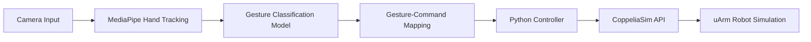

# 🤖 Gesture2Robot: Vision-Based Control Framework


---

## 📌 Overview

**Gesture2Robot** is an AI-driven system that enables **real-time, contactless control of a robotic arm using hand gestures**.
It replaces traditional control interfaces with an intuitive **vision-based human–robot interaction system**.

The system uses:

* 📷 Computer Vision (MediaPipe)
* 🧠 Deep Learning-based gesture classification
* 🦾 Robotic simulation (CoppeliaSim with uArm)
* 🔗 Real-time communication via Python APIs

---

## 🎥 Demo

> *https://drive.google.com/drive/folders/15XGOsYOvoUJvtio8NEPcqecgqdaamdSp?usp=sharing*

```bash
🔗 Demo Video https://drive.google.com/drive/folders/15XGOsYOvoUJvtio8NEPcqecgqdaamdSp?usp=sharing
```

### Example Workflow

1. User performs a hand gesture
2. Camera captures input
3. Model classifies gesture
4. Command is sent to robot
5. Robot executes action in real-time

---

## 🧠 System Architecture



---

## ⚙️ Features

* ✅ Real-time gesture recognition
* ✅ Contactless robot control
* ✅ 9-class gesture classification
* ✅ ~93% model accuracy
* ✅ Low latency (~90–179 ms)
* ✅ Simulation-based testing (safe & scalable)
* ✅ Modular and extensible architecture

---

## 🧪 Dataset

* 📊 **1,880 images**
* ✋ **9 gesture classes**
* 🌐 Sources: Google Images + Kaggle
* 🧹 Preprocessing:

  * Removed noisy/ambiguous samples
  * Balanced and labelled dataset
  * Structured into class directories

---

## 🏗️ Tech Stack

| Component            | Technology            |
| -------------------- | --------------------- |
| Gesture Recognition  | MediaPipe Model Maker |
| Programming Language | Python                |
| Simulation           | CoppeliaSim           |
| Robot Model          | uArm with gripper     |
| Communication        | Legacy Remote API     |

---

## 🚀 Installation

### 1. Clone the Repository

```bash
git clone https://github.com/your-username/gesture2robot.git
cd gesture2robot
```

### 2. Install Dependencies

```bash
pip install -r requirements.txt
```

### 3. Setup CoppeliaSim

* Install CoppeliaSim
* Load the provided scene file (`.ttt`)
* Enable Remote API

---

## ▶️ Usage

### Run Gesture Recognition

```bash
python gesture_recognition.py
```

### Run Robot Control

```bash
python robot_control.py
```

---

## ✋ Gesture Mapping

| Gesture     | Action         |
| ----------- | -------------- |
| Fist        | Stop           |
| Open Palm   | Start / Move   |
| Point Left  | Move Left      |
| Point Right | Move Right     |
| Thumbs Up   | Lift Object    |
| Thumbs Down | Drop Object    |
| Shaka       | Reset Position |
| None        | Idle           |

---

## 📊 Results

* 🎯 **Accuracy:** 93.26%
* 📉 **Loss:** 0.116
* ⚡ **Latency:** 90–179 ms
* 📈 Strong performance across most gesture classes
* ⚠️ Minor confusion between similar gestures (e.g., left vs right)

---

## 📉 Performance Visualization

```mermaid
bar
    title Gesture Classification Performance (F1 Score)
    "Fist" : 0.91
    "Open Palm" : 0.90
    "Shaka" : 0.89
    "Point Left" : 0.78
    "Point Right" : 0.71
    "None" : 0.70
```

---

## ⚠️ Limitations

* Limited gesture vocabulary
* Sensitivity to lighting & occlusion
* Difficulty distinguishing similar gestures
* 2D camera lacks depth perception

---

## 🔮 Future Work

* 🎯 Dynamic gesture recognition (sequences)
* 📡 Multi-modal interaction (gesture + voice)
* 📷 Depth camera integration (3D control)
* 🤖 Real robot deployment (beyond simulation)
* 🧠 Improved model with transformer-based vision models

---

## 🤝 Applications

* 🏭 Smart manufacturing
* 🏥 Healthcare robotics
* 🎓 Education & training
* ⚠️ Safety-critical environments
* 🤝 Human-robot collaboration (HRC)

---

## 📁 Project Structure

```bash
gesture2robot/
│── data/
│── models/
│── simulation/
│── src/
│   ├── gesture_recognition.py
│   ├── robot_control.py
│   └── utils.py
│── requirements.txt
│── README.md
```

---

## 👨‍💻 Author

**Yusuf M.S**
MSc AI & Robotics

---

## 🙏 Acknowledgements

* MediaPipe (Google)
* Kaggle datasets
* University of Aberdeen
* Project Supervisor

---

## 📜 License

This project is licensed under the **MIT License**.

---

## ⭐ Support

If you like this project:

* ⭐ Star the repo
* 🍴 Fork it
* 🤝 Contribute

